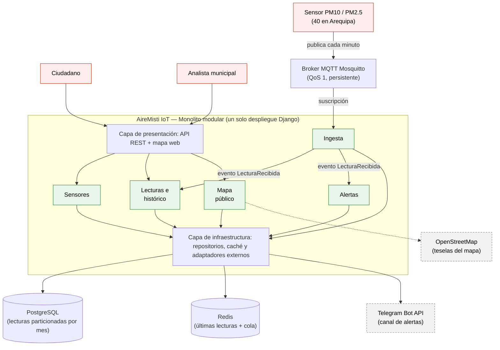

# AireMisti IoT — Laboratorio 04: Fundamentos de arquitectura de software
Construcción de Software · EPIS-UNSA · 2026-B

## Integrantes
| Nombre | Rol en el laboratorio |
|--------|-----------------------|
| Guillén Valcárcel, Daniel Josué | Diagramador (Mermaid, PlantUML, Python Diagrams) y redactor de ADR |
| Mengoa Valeriano, Brigitte Noelia | Analista de drivers y matriz de decisión, verificadora de IA |

## Caso
AireMisti IoT es una red de 40 sensores de calidad del aire (PM10 y PM2.5) instalados en Arequipa. Cada sensor envía una lectura por minuto; los ciudadanos consultan un mapa en tiempo real, el sistema emite una alerta pública cuando PM10 supera 150 µg/m³ y el analista municipal descarga el histórico.
**Atributo de calidad crítico:** ingesta y fiabilidad. No se debe perder ninguna lectura ante cortes de red de hasta 2 horas, gracias al almacenamiento local en el sensor.

## Arquitectura elegida
Monolito modular en Django con broker MQTT (4,50 en la matriz de decisión).

## Documentación
- [Drivers y escenarios de calidad](docs/architecture/drivers.md)
- [Matriz de decisión](docs/architecture/matriz-decision.md)
- [Bitácora de uso de IA](docs/architecture/bitacora-ia.md)
- Alternativa descartada: [alternativa.puml](docs/architecture/diagramas/alternativa.puml)
- Vista de despliegue: [despliegue.py](docs/architecture/diagramas/despliegue.py)

## Decisiones arquitectónicas
- [ADR-001: Estilo arquitectónico — monolito modular con broker MQTT](docs/architecture/adr/001-estilo-arquitectonico.md)
- [ADR-002: Almacenamiento de lecturas en PostgreSQL particionado](docs/architecture/adr/002-almacenamiento-lecturas.md)
- [ADR-003: Ingesta por MQTT con QoS 1 y credenciales por sensor](docs/architecture/adr/003-protocolo-ingesta.md)

## Reflexión sobre el uso de la IA
La IA aceleró la exploración: en minutos generó tres alternativas, los borradores de los diagramas y de los ADR, y su papel de "abogado del diablo" nos mostró riesgos que no habíamos considerado, como la pérdida de mensajes si el broker se reinicia.
Sin embargo, mostró un sesgo hacia tecnologías de moda: recomendó Kafka para 40 sensores, cuando un cálculo simple muestra apenas 0,67 lecturas por segundo.
También inventó datos: una clase Mosquitto inexistente en la librería diagrams y que QoS 2 evita toda pérdida aunque el broker no tenga persistencia.
Aprendimos a verificar cada afirmación contra la documentación oficial, a recalcular las cifras y a contrastar toda propuesta con nuestras restricciones (R-01 a R-05).
La IA propone; las decisiones y su justificación quedaron a cargo del equipo.
