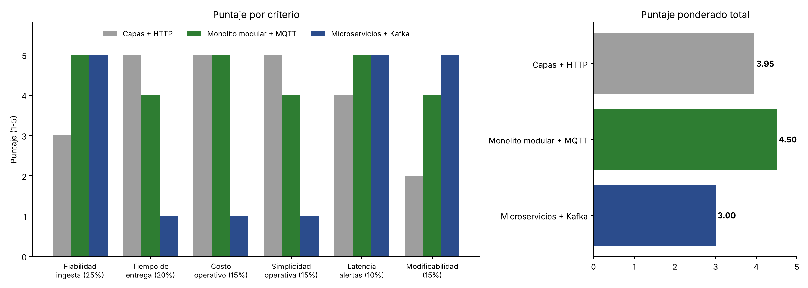

# Matriz de decisión — AireMisti IoT

## Alternativas
- **A. Monolito en capas con ingesta HTTP:** una aplicación Django en presentación, negocio y datos; cada sensor hace un POST por lectura a la API. Si el servidor no responde, el reintento depende solo del sensor.
- **B. Monolito modular con broker MQTT:** un despliegue Django dividido en cinco módulos (Ingesta, Sensores, Lecturas e histórico, Alertas y Mapa público). Los sensores publican en un broker Mosquitto con QoS 1 y sesiones persistentes; un proceso de ingesta del monolito consume y guarda en PostgreSQL.
- **C. Microservicios orientados a eventos con Kafka:** un servicio por dominio, Kafka como bus de eventos, base de datos por servicio y orquestación con Kubernetes.

## Criterios y pesos (suman 100 %)
| Criterio                 | Peso  | Justificación (driver relacionado)                                        |
|--------------------------|-------|----------------------------------------------------------------------------|
| Fiabilidad de la ingesta | 25 %  | QA-01 y QA-03: atributo crítico, 0 lecturas perdidas                       |
| Tiempo de entrega        | 20 %  | R-01: el MVP debe estar en producción en 1 mes                             |
| Costo operativo          | 15 %  | R-03: un único VPS de bajo costo                                           |
| Simplicidad operativa    | 15 %  | R-02: 2 developers sin experiencia en Kafka ni Kubernetes                  |
| Latencia de alertas      | 10 %  | QA-02: alerta visible en ≤ 60 s                                            |
| Modificabilidad          | 15 %  | RF-06: agregar sensores y nuevos contaminantes sin tocar otros módulos     |
| **Total**                | **100 %** |                                                                        |

## Matriz (puntaje 1 = muy malo … 5 = excelente)
| Criterio (peso)                 | A. Capas + HTTP | B. Monolito modular + MQTT | C. Microservicios + Kafka |
|---------------------------------|-----------------|----------------------------|---------------------------|
| Fiabilidad de la ingesta (25 %) | 3               | 5                          | 5                         |
| Tiempo de entrega (20 %)        | 5               | 4                          | 1                         |
| Costo operativo (15 %)          | 5               | 5                          | 1                         |
| Simplicidad operativa (15 %)    | 5               | 4                          | 1                         |
| Latencia de alertas (10 %)      | 4               | 5                          | 5                         |
| Modificabilidad (15 %)          | 2               | 4                          | 5                         |
| **Total ponderado**             | **3,95**        | **4,50**                   | **3,00**                  |

Total ponderado = Σ (peso × puntaje).
- A: 0,25×3 + 0,20×5 + 0,15×5 + 0,15×5 + 0,10×4 + 0,15×2 = 3,95
- B: 0,25×5 + 0,20×4 + 0,15×5 + 0,15×4 + 0,10×5 + 0,15×4 = 4,50
- C: 0,25×5 + 0,20×1 + 0,15×1 + 0,15×1 + 0,10×5 + 0,15×5 = 3,00

## Justificación de puntajes clave
- **Fiabilidad:** en A, si la API está caída o reiniciándose, el sensor debe gestionar solo los reintentos y la lectura se puede perder; en B, el broker con QoS 1 y sesión persistente retiene los mensajes hasta que la ingesta los confirma. C también es fiable, pero a un costo mucho mayor.
- **Tiempo de entrega y simplicidad:** B solo agrega Mosquitto, que se instala en el mismo VPS con un archivo de configuración; C exige operar Kafka, varios servicios y Kubernetes, algo inviable en 1 mes con 2 personas.
- **Latencia:** con MQTT la lectura llega al servidor en milisegundos; en A depende del ciclo de reintentos HTTP del sensor.

## Afirmación de la IA corregida
La IA recomendó C "porque la ingesta IoT en tiempo real necesita Kafka para escalar". Se verificó con un cálculo: 40 sensores × 1 lectura/min = 0,67 lecturas/s, y el peor caso tras un corte de 2 h son 4800 lecturas, que PostgreSQL procesa en menos de un minuto. Kafka está pensado para cientos de miles de mensajes por segundo; aquí no se justifica y además incumple R-01, R-02 y R-03.

## Conclusión
Elegimos **B. Monolito modular con broker MQTT** (4,50) porque garantiza que no se pierdan lecturas con un solo servidor, mantiene la latencia de alertas por debajo de un minuto y es construible por 2 developers en 1 mes. Ver [ADR-001](adr/001-estilo-arquitectonico.md).

