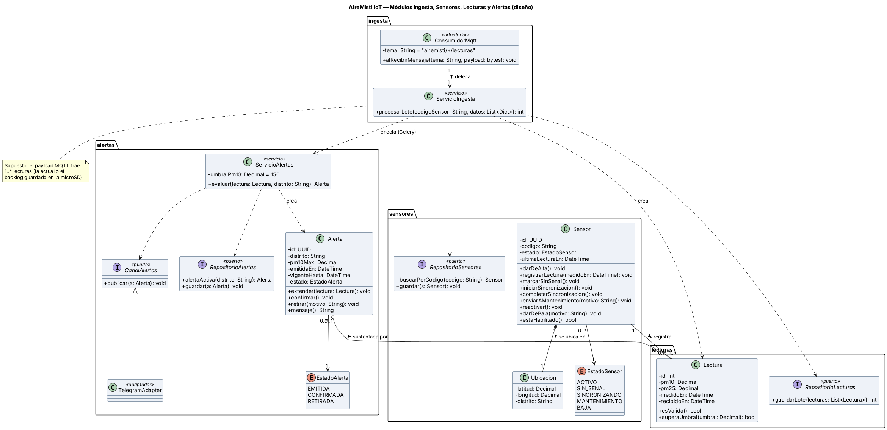
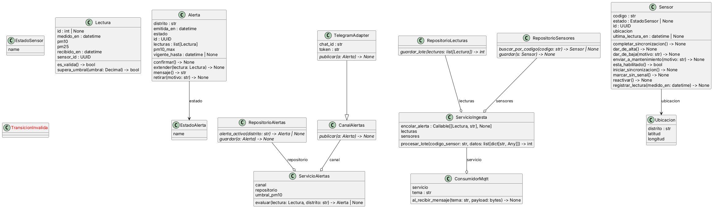

# Round-trip: diagrama de diseño ↔ código — AireMisti IoT

## Flujo aplicado

1. **Ingeniería directa:** a partir de [clases.puml](clases.puml) se generó con IA (Prompt IA 2 adaptado) el esqueleto en Python 3.10+ en [`src/airemisti/`](../../src/airemisti), un subpaquete por módulo del ADR-001.
2. **Pruebas:** [`tests/test_ingesta_alertas.py`](../../tests/test_ingesta_alertas.py) cubre los 4 criterios de aceptación de HU-03 y las 10 transiciones de [estados-sensor.mmd](estados-sensor.mmd) (17 pruebas, todas pasan; la número 17 se agregó tras la revisión de consistencia).
3. **Ingeniería inversa:**

```bash
pip install pylint
cd src
pyreverse -o puml -p airemisti airemisti
java -jar plantuml.jar -tpng -o img classes_airemisti.puml packages_airemisti.puml
```

Resultado: [classes_airemisti.puml](classes_airemisti.puml) y [packages_airemisti.puml](packages_airemisti.puml).

| Diagrama de diseño | Diagrama obtenido del código |
|---|---|
|  |  |

## Diferencias observadas

| # | Diferencia observada | Causa | Acción |
|---|---|---|---|
| 1 | El umbral de 150 µg/m³ aparecía dos veces: como constante en `ingesta/servicio.py` y como valor por defecto en `ServicioAlertas`. | Al generar el código, la IA lo repitió porque la ingesta decide si encolar la alerta y el servicio de alertas decide si emitirla. | **Corregir el código:** se movió a `compartido/parametros.py` (`UMBRAL_PM10`) y ambos módulos lo importan. Se anotó en la nota de [paquetes.puml](paquetes.puml). |
| 2 | No aparecen la asociación Sensor–Lectura ni la agregación Alerta–Lectura; `Lectura` tiene `sensor_id: UUID` y `Alerta` tiene `lecturas: list[Lectura]`. | Entre módulos se navega por identificador (ADR-001: cada módulo tiene su propio esquema) y pyreverse no infiere asociaciones desde colecciones tipadas. | **Documentar:** el diagrama de diseño se mantiene porque expresa la regla del negocio; el `sensor_id` es su implementación. |
| 3 | La composición Sensor–Ubicación aparece como asociación simple (`-->`). | pyreverse no distingue composición; en Python se expresa con un `dataclass(frozen=True)` creado junto con el sensor. | **Documentar** la limitación de la herramienta. |
| 4 | No hay multiplicidades (por ejemplo, `1..*` lecturas por alerta). | El código no expresa multiplicidades. | **Corregir el código:** `Alerta.__post_init__` lanza `ValueError` si se crea sin lecturas (regla C3). |
| 5 | Los puertos (`RepositorioSensores`, `CanalAlertas`, …) aparecen como clases, no como interfaces, y las dependencias `..>` de los servicios aparecen como agregación (`--o`). | Python implementa interfaces con `ABC` y los puertos se inyectan por constructor, por eso pyreverse los ve como atributos. | **Documentar:** es la forma idiomática de puertos y adaptadores en Python. |
| 6 | El diagrama de paquetes generado no muestra `ingesta → alertas`. | La ingesta recibe la tarea `encolar_alerta` como `Callable` inyectado (tarea Celery), así que no hay `import` directo. | **Corregir el diagrama:** la etiqueta de [paquetes.puml](paquetes.puml) aclara que la dependencia es una tarea inyectada. Sigue sin haber ciclos (C4). |
| 7 | Los enumerados muestran solo `name` (sin ACTIVO, SIN_SENAL, …) y faltan la visibilidad y el tipo de `ubicacion`, `canal` y `repositorio`. | pyreverse no lista los miembros de `Enum` y solo muestra tipos de atributos anotados en el cuerpo de la clase. | **Documentar** la limitación; el diagrama de diseño es la referencia. |
| 8 | Nombres en snake_case (`procesar_lote`, `marcar_sin_senal`) frente a camelCase en el diagrama. | Convención de Python (PEP 8). | **Documentar** la equivalencia (C5): `procesarLote` ≡ `procesar_lote`. |

## Conclusión

La ingeniería inversa no es útil para recuperar relaciones ni multiplicidades, pero sí para encontrar duplicación (diferencia 1) y dependencias reales entre paquetes (diferencia 6). El diagrama de diseño sigue siendo la referencia de las reglas del negocio y el código, la de la implementación.
